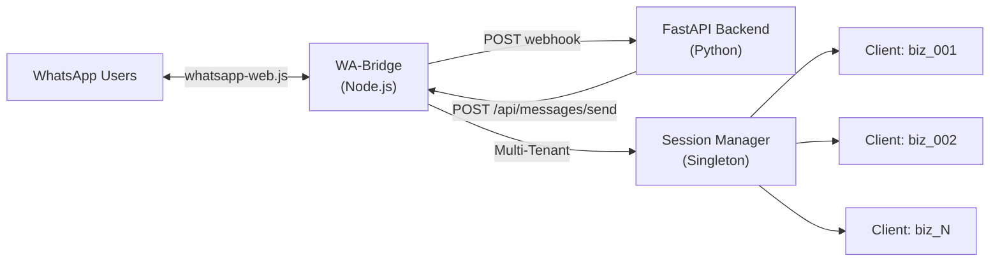
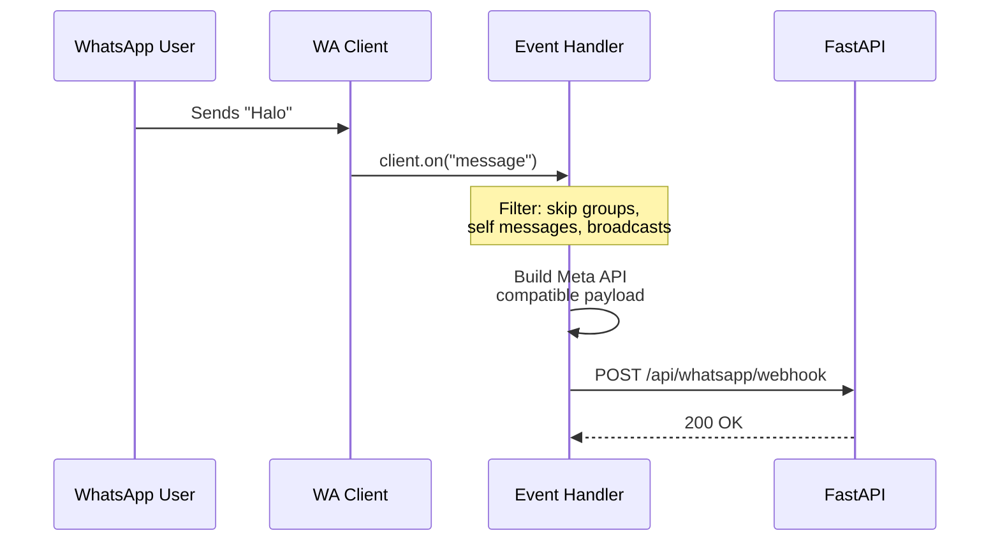
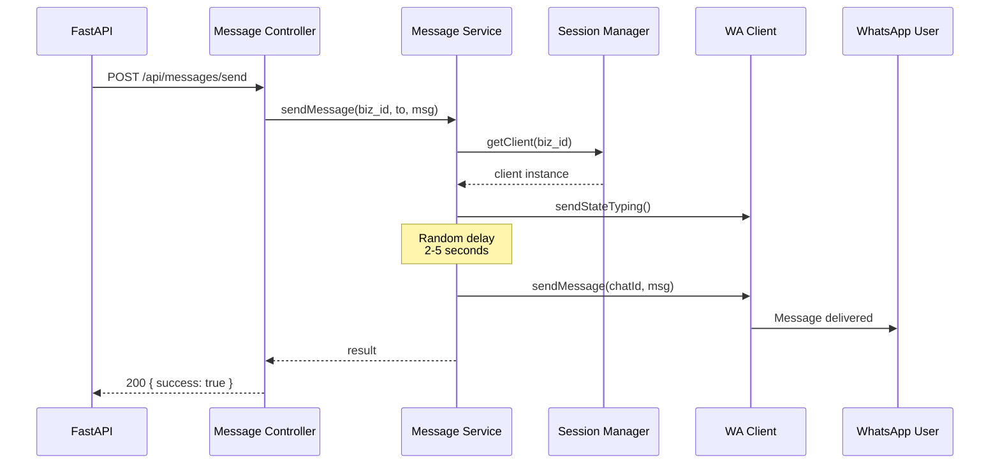

# WA-Bridge — WhatsApp Gateway Documentation

## Arsitektur Overview



---

## Struktur Folder

```
wa-bridge/
├── .env                          # Environment variables
├── .env.example                  # Environment template
├── package.json                  # Dependencies & scripts
├── bridge.js                     # (Legacy) Single-tenant file — deprecated
└── src/
    ├── app.js                    # Entry point — Express setup, graceful shutdown
    ├── config/
    │   ├── env.js                # Loads & validates .env variables
    │   └── index.js              # Barrel export
    ├── clients/
    │   ├── fastapi.client.js     # Axios instance with interceptors for FastAPI
    │   └── index.js
    ├── controllers/
    │   ├── session.controller.js # HTTP handlers for session CRUD
    │   ├── message.controller.js # HTTP handler for sending messages
    │   ├── health.controller.js  # Health check endpoint
    │   └── index.js
    ├── events/
    │   ├── whatsapp.events.js    # QR, auth, ready, message, disconnect handlers
    │   └── index.js
    ├── middlewares/
    │   ├── error.handler.js      # Global error → JSON response
    │   ├── request.logger.js     # HTTP request/response logging
    │   └── index.js
    ├── routes/
    │   ├── session.routes.js     # /api/sessions/*
    │   ├── message.routes.js     # /api/messages/*
    │   ├── health.routes.js      # /api/health
    │   └── index.js              # Aggregates all routes under /api
    ├── services/
    │   ├── session.manager.js    # Singleton — manages all WA client instances
    │   ├── whatsapp.service.js   # Session lifecycle (create, destroy, reconnect)
    │   ├── message.service.js    # Send messages with typing indicator & delay
    │   └── index.js
    ├── utils/
    │   ├── errors.js             # Custom error classes (AppError, NotFound, etc.)
    │   ├── helpers.js            # sleep, randomDelay, formatChatId, etc.
    │   ├── logger.js             # Structured logger with levels & context
    │   └── index.js
    └── validators/
        ├── session.validator.js  # Validates POST /api/sessions body
        ├── message.validator.js  # Validates POST /api/messages/send body
        └── index.js
```

### Tanggung Jawab Setiap Folder

| Folder | Tanggung Jawab |
|---|---|
| `config/` | Memuat & memvalidasi environment variables |
| `clients/` | HTTP client (Axios) untuk komunikasi dengan FastAPI |
| `controllers/` | Menerima HTTP request, delegasi ke service, return response |
| `events/` | Event handler WhatsApp (qr, ready, message, disconnect) |
| `middlewares/` | Cross-cutting concerns: error handling, request logging |
| `routes/` | Definisi endpoint dan mapping ke controller |
| `services/` | Business logic: session management, message sending |
| `utils/` | Shared utilities: logger, helpers, custom errors |
| `validators/` | Validasi request body sebelum masuk ke controller |

---

## Environment Variables

```env
PORT=3000
NODE_ENV=development
FASTAPI_URL=http://localhost:8000
SESSION_PATH=.wwebjs_auth
```

---

## API Endpoints

### 1. Create Session — `POST /api/sessions`

Membuat koneksi WhatsApp baru untuk sebuah bisnis.

**Request:**
```json
{
  "business_id": "biz_123"
}
```

**Response (201):**
```json
{
  "success": true,
  "data": {
    "business_id": "biz_123",
    "session_id": "biz_123",
    "status": "pending_qr",
    "qr_code": "data:image/png;base64,iVBORw0KGgo..."
  }
}
```

**Error — Duplicate (409):**
```json
{
  "success": false,
  "error": {
    "code": "CONFLICT",
    "message": "Session for business biz_123 is already connected"
  }
}
```

---

### 2. Get Session Status — `GET /api/sessions/:business_id`

**Response (200):**
```json
{
  "success": true,
  "data": {
    "business_id": "biz_123",
    "session_id": "biz_123",
    "status": "connected",
    "metadata": {
      "phone_number": "628123456789",
      "display_name": "Toko ABC",
      "business_id": "biz_123",
      "session_id": "biz_123"
    },
    "qr_code": null
  }
}
```

**Status Values:** `pending_qr` → `authenticating` → `connected` → `disconnected` → `destroyed`

---

### 3. List All Sessions — `GET /api/sessions`

**Response (200):**
```json
{
  "success": true,
  "data": [
    {
      "business_id": "biz_123",
      "session_id": "biz_123",
      "status": "connected",
      "metadata": { "phone_number": "628123456789", "display_name": "Toko ABC" }
    },
    {
      "business_id": "biz_456",
      "session_id": "biz_456",
      "status": "pending_qr",
      "metadata": null
    }
  ],
  "total": 2
}
```

---

### 4. Destroy Session — `DELETE /api/sessions/:business_id`

**Response (200):**
```json
{
  "success": true,
  "data": {
    "business_id": "biz_123",
    "status": "destroyed"
  }
}
```

---

### 5. Reconnect Session — `POST /api/sessions/:business_id/reconnect`

**Response (200):**
```json
{
  "success": true,
  "data": {
    "business_id": "biz_123",
    "session_id": "biz_123",
    "status": "pending_qr",
    "qr_code": "data:image/png;base64,..."
  }
}
```

---

### 6. Send Message — `POST /api/messages/send`

Endpoint yang dipanggil oleh FastAPI untuk mengirim pesan ke WhatsApp.

**Request:**
```json
{
  "business_id": "biz_123",
  "to": "628987654321",
  "message": "Halo, ada yang bisa kami bantu?"
}
```

**Response (200):**
```json
{
  "success": true,
  "data": {
    "status": "success",
    "business_id": "biz_123",
    "to": "628987654321",
    "message_id": "true_628987654321@c.us_3A..."
  }
}
```

---

### 7. Health Check — `GET /api/health`

**Response (200):**
```json
{
  "status": "ok",
  "service": "wa-bridge",
  "timestamp": "2026-06-06T14:08:36.000Z",
  "uptime": 120.5,
  "sessions": {
    "total": 2,
    "connected": 1
  }
}
```

---

## Event Flows

### Pesan Masuk (WhatsApp → FastAPI)



### Pesan Keluar (FastAPI → WhatsApp)



---

## Cara Menjalankan

```bash
# 1. Install dependencies
npm install

# 2. Copy dan edit environment variables
cp .env.example .env

# 3. Jalankan dalam mode development
npm run dev

# 4. Jalankan dalam mode production
npm start
```

> [!IMPORTANT]
> Pastikan FastAPI backend sudah berjalan di URL yang sesuai dengan `FASTAPI_URL` di file `.env` agar notifikasi koneksi dan forwarding pesan berjalan dengan benar.

---

## Payload Meta API Compatibility

Payload pesan masuk yang dikirim ke FastAPI sudah mengikuti format Meta WhatsApp Business API, sehingga ketika migrasi ke official API, backend FastAPI **tidak perlu mengubah logic parsing**:

```json
{
  "object": "whatsapp_business_account",
  "entry": [{
    "changes": [{
      "value": {
        "messaging_product": "whatsapp",
        "metadata": {
          "display_phone_number": "628123456789",
          "phone_number_id": "biz_123"
        },
        "contacts": [{
          "profile": { "name": "John Doe" },
          "wa_id": "628987654321"
        }],
        "messages": [{
          "from": "628987654321",
          "id": "msg_abc123",
          "timestamp": "1717689600",
          "type": "text",
          "text": { "body": "Halo" }
        }]
      },
      "field": "messages"
    }]
  }]
}
```
